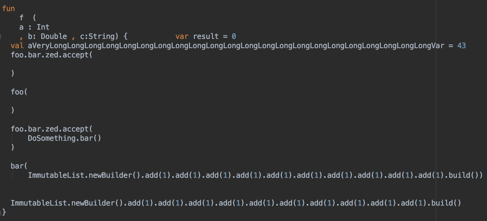

# ktfmt [](https://github.com/facebook/ktfmt/releases/)   [](https://github.com/facebook/ktfmt/actions/workflows/build_and_test.yml "GitHub Actions workflow status")   [](https://slack-chats.kotlinlang.org/c/ktfmt)   [](https://surveys.jetbrains.com/s3/kotlin-slack-sign-up)   [](https://github.com/facebook/ktfmt/issues)

`ktfmt` is a program that pretty-prints (formats) Kotlin code, based on [google-java-format](https://github.com/google/google-java-format).

**Note** that `ktfmt` still has some rough edges which we're constantly working on fixing.

The minimum supported runtime version is JDK 11, released September 2018.

## Demo

|Before Formatting| Formatted by `ktfmt`|
| ---- | ---- |
|  |  |

For comparison, the same code formatted by [`ktlint`](https://github.com/pinterest/ktlint) and IntelliJ:

| Formatted by `ktlint`|Formatted by IntelliJ|
| ------ | --------|
|  |  |

## Playground

We have a [live playground](https://facebook.github.io/ktfmt/) where you can easily see how ktfmt would format your code.
Give it a try! https://facebook.github.io/ktfmt/

## Using the formatter

### IntelliJ, Android Studio, and other JetBrains IDEs

A
[ktfmt IntelliJ plugin](https://plugins.jetbrains.com/plugin/14912-ktfmt)
is available from the plugin repository. To install it, go to your IDE's
settings and select the `Plugins` category. Click the `Marketplace` tab, search
for the `ktfmt` plugin, and click the `Install` button.

The plugin will be disabled by default. To enable it in the current project, go
to `File→Settings...→ktfmt Settings` (or `IntelliJ
IDEA→Preferences...→Editor→ktfmt Settings` on macOS) and
check the `Enable ktfmt` checkbox. (A notification will be
presented when you first open a project offering to do this for you.)

To enable it by default in new projects, use `File→New Project Settings→Preferences for new Projects→Editor→ktfmt Settings`.

When enabled, it will replace the normal `Reformat Code` action, which can be
triggered from the `Code` menu or with the Ctrl-Alt-L (by default) keyboard
shortcut.

To configure IntelliJ to approximate ktfmt's formatting rules during code editing,
you can edit your project's
[`.editorconfig` file](https://www.jetbrains.com/help/idea/configuring-code-style.html#editorconfig)
to include the Kotlin section from one of the files inside
[`docs/editorconfig`](docs/editorconfig).
Not all of ktfmt's rules can be represented as IntelliJ editor settings, so you will still
need to run ktfmt. Alternately, that file can be used as a reference to manually change
the project's code style settings.

### from the command-line

[Download the formatter](https://github.com/facebook/ktfmt/releases)
and run it with:

```
java -jar /path/to/ktfmt-<VERSION>-jar-with-dependencies.jar [--dropbox-style] [files...]
```

`--dropbox-style` makes `ktfmt` use a block indent of 4 spaces instead of 2. See below for details.

***Note:*** *There is no configurability as to the formatter's algorithm for
formatting (apart from `--dropbox-style`). This is a deliberate design decision to unify our code
formatting on a single format.*

### using Gradle

A [Gradle plugin (ktfmt-gradle)](https://github.com/cortinico/ktfmt-gradle) is available on the Gradle Plugin Portal. To set it up, just follow the instructions in the [How-to-use section](https://github.com/cortinico/ktfmt-gradle#how-to-use-).

Alternatively, you can use [Spotless](https://github.com/diffplug/spotless) with the [ktfmt Gradle plugin](https://github.com/diffplug/spotless/tree/main/plugin-gradle#ktfmt).

### using Maven

Consider using [Spotless](https://github.com/diffplug/spotless) with the [ktfmt Maven plugin](https://github.com/diffplug/spotless/tree/main/plugin-maven#ktfmt).

## FAQ

### `ktfmt` vs `ktlint` vs IntelliJ

`ktfmt` uses google-java-format's underlying engine, and as such, many items on [google-java-format's FAQ](https://github.com/google/google-java-format/wiki/FAQ) apply to `ktfmt` as well.

In particular,
1. `ktfmt` ignores most existing formatting. It respects existing newlines in some places, but in general, its output is deterministic and is independent of the input code.
2. `ktfmt` exposes no configuration options that govern formatting behavior. See https://github.com/google/google-java-format/wiki/FAQ#i-just-need-to-configure-it-a-bit-differently-how for the rationale.

These two properties make `ktfmt` a good fit in large Kotlin code bases, where consistency is very important.

We created `ktfmt` because `ktlint` and IntelliJ sometime fail to produce nice-looking code that fits in 100 columns, as can be seen in the [Demo](README.md#Demo) section.

### `ktfmt` uses a 2-space indent; why not 4? any way to change that?

Two reasons -
1. Many of our projects use a mixture of Kotlin and Java, and we found the back-and-forth in styles to be distracting.
2. From a pragmatic standpoint, the formatting engine behind google-java-format uses more whitespace and newlines than other formatters. Using an indentation of 4 spaces quickly reaches the maximal column width.

However, we do offer an escape-hatch for projects that absolutely cannot make the move to `ktfmt` because of 2-space: the `--dropbox-style` flag changes block indents to 4-space.

## Developer's Guide

### Setup

* Open `pom.xml` in IntelliJ. Choose "Open as a Project"
* The IntelliJ project will unfortunately be broken on import. To fix,
    * Turn off ErrorProne by removing the compiler parameters in IntelliJ at the bottom of "Settings -> Build, Execution, Deployment -> Compiler -> Java Compiler" (see https://github.com/google/google-java-format/issues/417)

### Development

* Currently, we mainly develop by adding tests to `FormatterTest.kt`.

### Building on the Command Line

* Run `mvn install`
* Run `java -jar core/target/ktfmt-<VERSION>-jar-with-dependencies.jar`

### Releasing

See [RELEASING.md](RELEASING.md).

## License

Apache License 2.0
