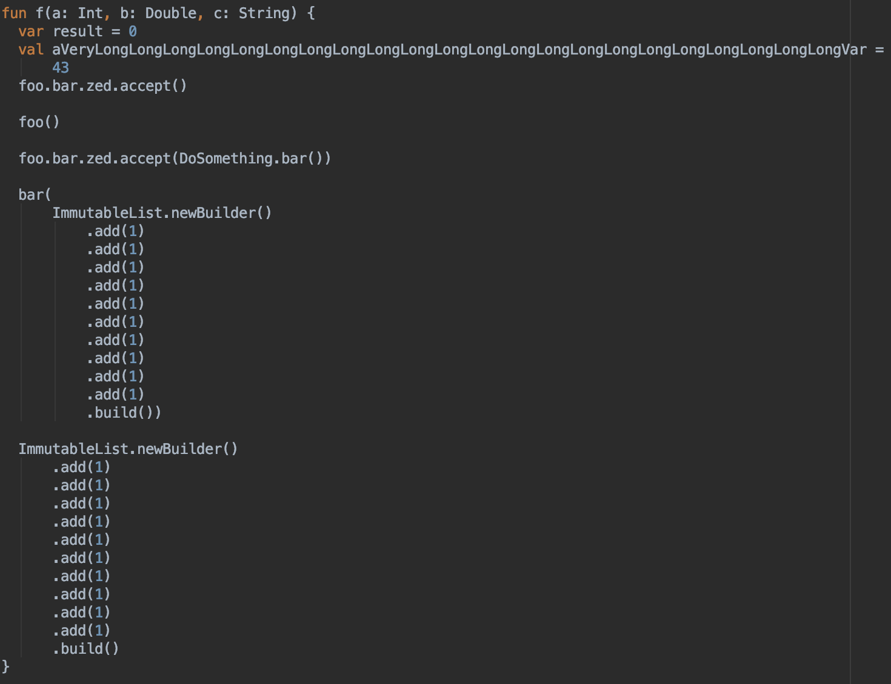
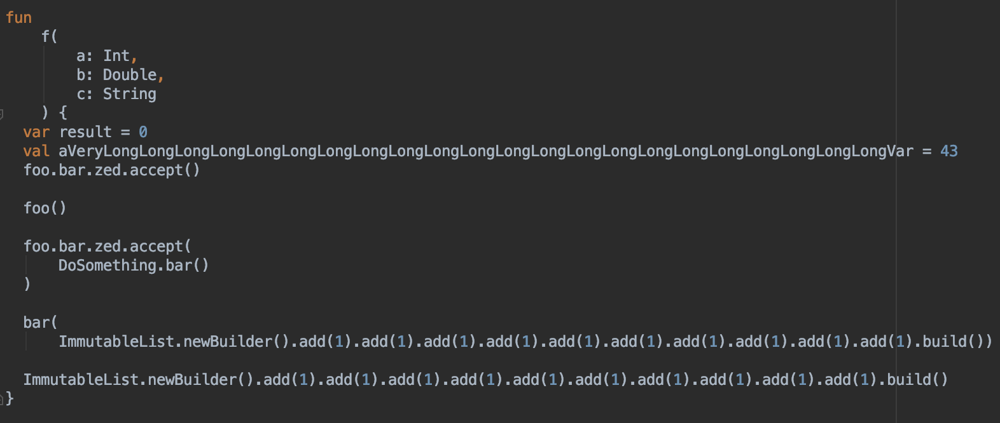
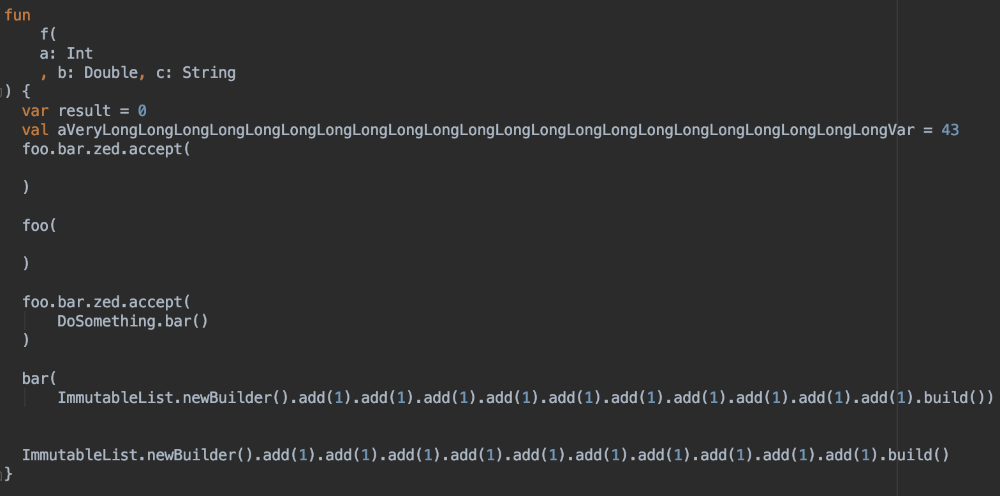

# ktfmt

`ktfmt` is a program that pretty-prints (formats) Kotlin code, based on [google-java-format](https://github.com/google/google-java-format).

**Note** that `ktfmt` still has some rough edges which we're constantly working on fixing.

## Demo

|Before Formatting| Formatted by `ktfmt`| 
| ---- | ---- |
|  |  |

For comparison, this is how the same code is formatted by [`ktlint`](https://github.com/pinterest/ktlint) and IntelliJ:

| Formatted by `ktlint`|Formatted by IntelliJ|
| ------ | --------|
|  |  |

# Using on the command-line

* Make sure the `vendor/google-java/format` submodule is populated. Either clone with submodules (`git pull --recurse-submodules https://github.com/facebookincubator/ktfmt.git`) or populate the submodule after cloning (`git submodule update --init`)
* Run `mvn install`
* Run `java -jar core/target/ktfmt-0.1-SNAPSHOT-jar-with-dependencies.jar`

# FAQ

## `ktfmt` vs `ktlint` vs IntelliJ

`ktfmt` uses google-java-format's underlying engine, and as such, many items on [google-java-format's FAQ](https://github.com/google/google-java-format/wiki/FAQ) apply to `ktfmt` as well.

In particular,
1. `ktfmt` ignores most existing formatting. It respects existing newlines in some places, but in general, its output is determinstic and is independent of the input code.
2. `ktfmt` exposes no configuration options that govern formatting behavior. See https://github.com/google/google-java-format/wiki/FAQ#i-just-need-to-configure-it-a-bit-differently-how for the rationale.

These two properties make `ktfmt` a good fit in large Kotlin code bases, where consistency is very important.

We created `ktfmt` because `ktlint` and IntelliJ sometime fail to produce nice-looking code that fits in 100 columns, as can be seen in the [Demo](README.md#Demo) section.

## `ktfmt` uses a 2-space indent; why not 4?

Two reasons -
1. Many of our projects use a mixture of Kotlin and Java, and we found the back-and-forth in styles to be distracting.
2. From a pragmatic standpoint, the formatting engine behind google-java-format uses more whitespace and newlines than other formatters. Using an indentation of 4 spaces quickly reaches the maximal column width.

# Developer's Guide

## Setup

* Make sure the `vendor/google-java/format` submodule is populated. Either clone with submodules (`git pull --recurse-submodules https://github.com/facebookincubator/ktfmt.git`) or populate the submodule after cloning (`git submodule update --init`)
* Open `pom.xml` in IntelliJ. Choose "Open as a Project"
* The IntelliJ project will unfortunately be broken on import. To fix,
    * Turn off ErrorProne by removing the compiler parameters in IntelliJ at the bottom of "Settings -> Build, Execution, Deployment -> Compiler -> Java Compiler" (see https://github.com/google/google-java-format/issues/417)
    * Right click on "vendor/google-java-format/pom.xml" and choose "Add maven project"    

## Development

* Currently, we mainly develop by adding tests to `FormatterKtTest.kt`.

# License

Apache License 2.0
